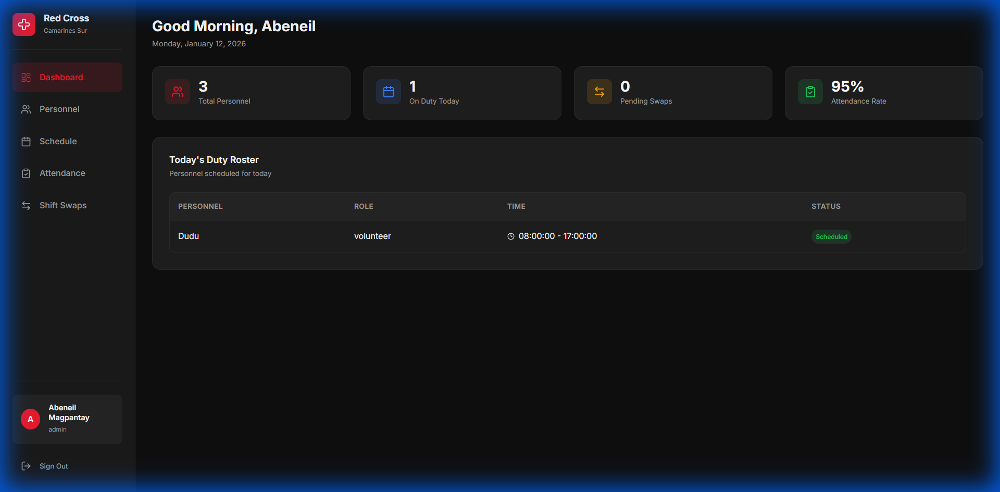
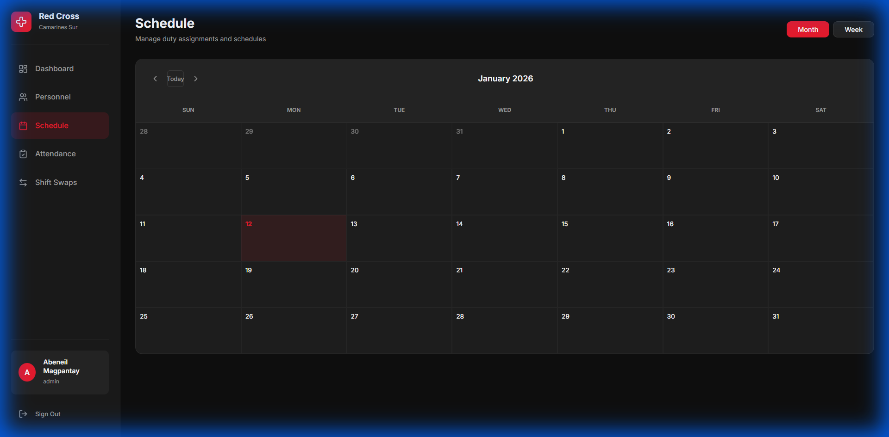

# 🏥 Red Cross Camarines Sur Scheduling System

<div align="center">


### A modern, cloud-native duty scheduling platform for managing Red Cross personnel, shifts, and attendance.

[](https://react.dev/)
[](https://vitejs.dev/)
[](https://supabase.com/)
[](LICENSE)

</div>

---

## 🚀 Overview

The **Red Cross Scheduler** allows administrators to efficiently manage volunteer rosters, track attendance in real-time, and handle shift swaps seamlessly. Built with performance and user experience in mind, it replaces manual tracking with a robust, database-backed solution.

## ✨ Key Features

- **🔐 Role-Based Authentication**: Secure admin and staff portals powered by Supabase Auth along with automated account provisioning.
- **📅 Interactive Schedule**: Drag-and-drop style calendar interface for assigning duties and managing conflicts.
- **✅ Attendance Tracking**: Digital logbook for checking in/out, marking status (Present/Late/Absent), and generating reports.
- **🔄 Smart Swap System**: Automated workflow for personnel to request shift exchanges with admin approval.
- **📱 Responsive Design**: Fully operational on mobile devices for field use.

## 📸 Showcase

### Admin Dashboard
*Real-time overview of personnel status, pending requests, and today's roster.*


### Scheduling Interface
*Intuitive calendar view for managing monthly duties and assignments.*


---

## 🛠 Tech Stack

| Component | Technology | Description |
|-----------|------------|-------------|
| **Frontend** | React + Vite | Fast, responsive UI library |
| **Backend** | Supabase | PostgreSQL Database & Authentication |
| **Styling** | CSS Variables | Custom Design System (No heavy frameworks) |
| **Icons** | Lucide React | Modern, lightweight component icons |
| **Deploy** | Vercel | CI/CD and Hosting |

---

## ⚡ Quick Start

### Prerequisites
- Node.js 20+
- A Supabase Project (Free Tier)

### Installation

1.  **Clone the repository**
    ```bash
    git clone https://github.com/AbeneilMagpantay/red-cross-scheduler.git
    cd red-cross-scheduler
    ```

2.  **Install dependencies**
    ```bash
    npm install
    ```

3.  **Environment Setup**
    Create a `.env.local` file in the root directory:
    ```env
    VITE_SUPABASE_URL=your_project_url
    VITE_SUPABASE_ANON_KEY=your_anon_key
    ```

4.  **Run Locally**
    ```bash
    npm run dev
    ```

---

## 🤝 Contributing

Contributions are welcome! Please fork the repository and submit a pull request for any enhancements.

1.  Fork the Project
2.  Create your Feature Branch (`git checkout -b feature/AmazingFeature`)
3.  Commit your Changes (`git commit -m 'Add some AmazingFeature'`)
4.  Push to the Branch (`git push origin feature/AmazingFeature`)
5.  Open a Pull Request

## 📄 License

Distributed under the MIT License. See `LICENSE` for more information.
