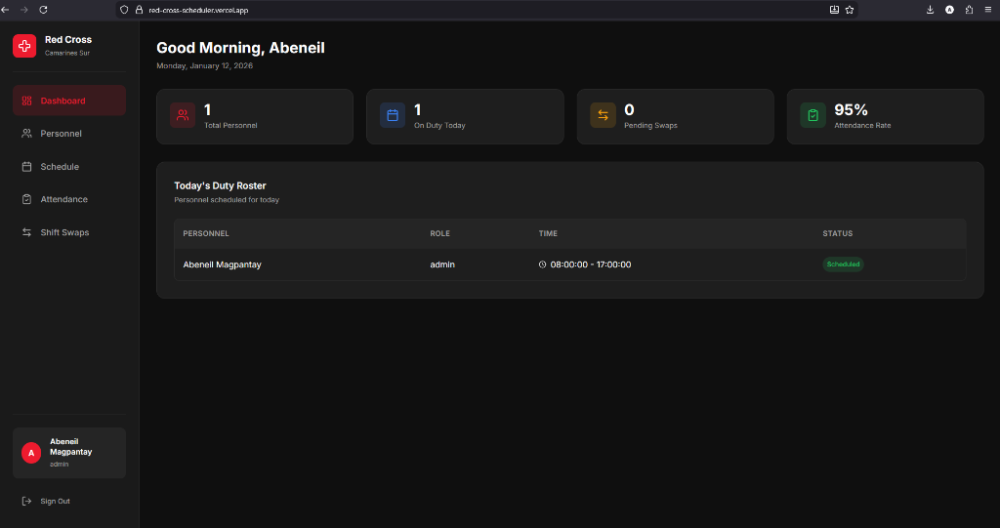
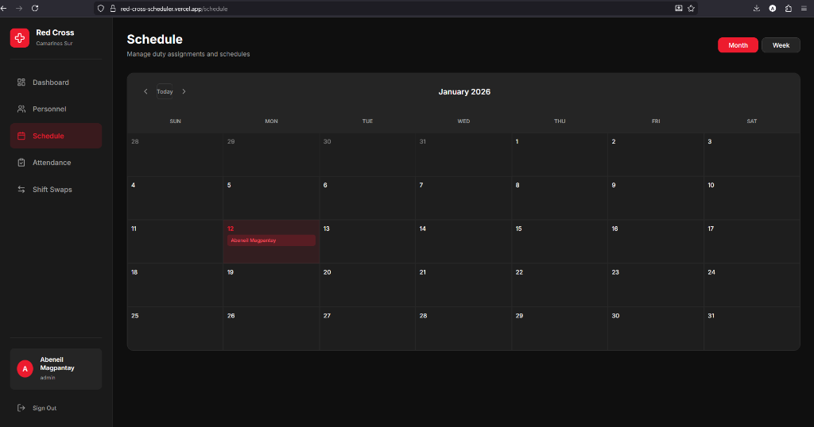
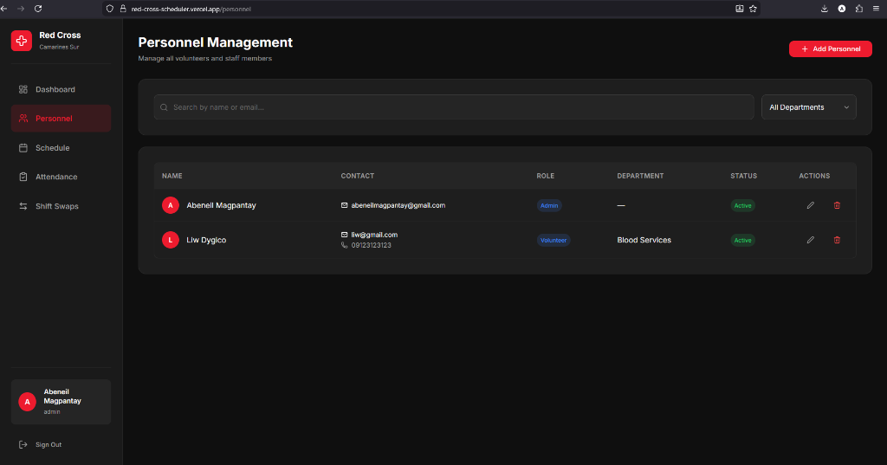
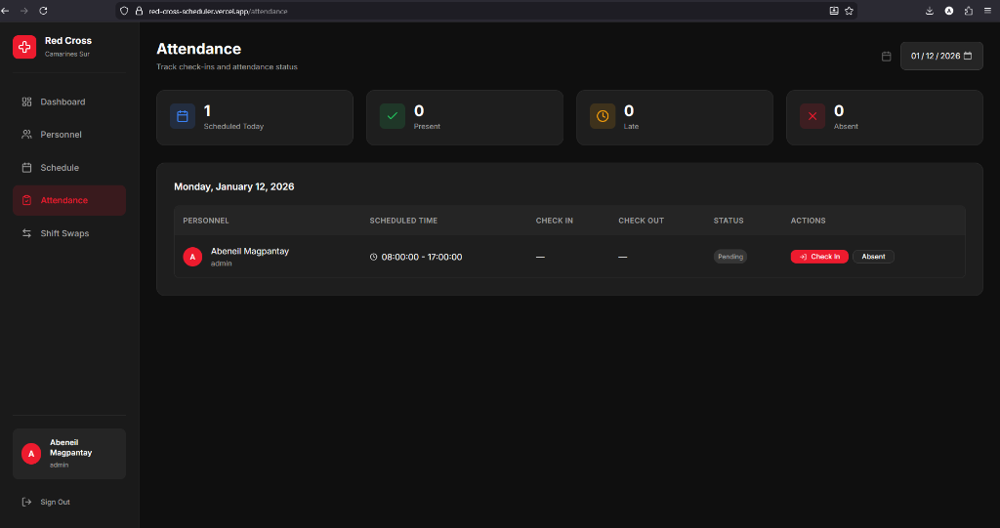
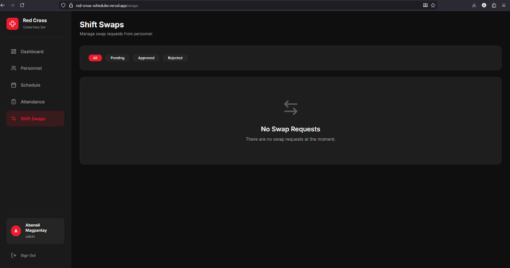

# Red Cross (Camarines Sur) Scheduling System

A comprehensive web-based platform designed to streamline duty scheduling, personnel management, and attendance tracking for the Red Cross Camarines Sur Chapter. This solution modernizes the workflow by replacing manual logs with a centralized, real-time database system.



## Table of Contents

- [Features](#features)
- [Built With](#built-with)
- [Getting Started](#getting-started)
- [Usage](#usage)
- [Deploy](#deploy)
- [License](#license)

## Features

*   **Role-Based Access Control**: Secure authentication distinguishing between administrators and standard volunteers.
*   **Dynamic Scheduling**: Drag-and-drop calendar interface for assigning field duties and managing rosters.
*   **Personnel Management**: Centralized database for staff profiles, contact details, and department allocation.
*   **Attendance Tracking**: Digital check-in/check-out system with automated status reporting (Present, Late, Absent).
*   **Shift Swapping**: Automated workflow for personnel to request and validate shift exchanges.
*   **Real-time Dashboard**: Live statistics on workforce deployment and pending administrative actions.

## Built With

This project exploits a modern tech stack to ensure performance, scalability, and ease of maintenance.

*   [React](https://reactjs.org/) - Frontend library for building user interfaces
*   [Vite](https://vitejs.dev/) - Next Generation Frontend Tooling
*   [Supabase](https://supabase.com/) - Open Source Firebase alternative (PostgreSQL + Auth)
*   [Lucide React](https://lucide.dev/) - Consistent icon set

## Getting Started

Follow these steps to set up the project locally.

### Prerequisites

*   Node.js (v20 or higher recommended)
*   npm or yarn
*   A Supabase project (Free Tier is sufficient)

### Installation

1.  Clone the repository
    ```sh
    git clone https://github.com/AbeneilMagpantay/red-cross-scheduler.git
    ```
2.  Install NPM packages
    ```sh
    npm install
    ```
3.  Configure Environment Variables
    Create a `.env.local` file in the root directory and add your Supabase credentials:
    ```env
    VITE_SUPABASE_URL=your_supabase_project_url
    VITE_SUPABASE_ANON_KEY=your_supabase_anon_key
    ```
4.  Run the application
    ```sh
    npm run dev
    ```

## Usage

### Scheduling View
The core interface allows administrators to view and manage monthly schedules. Assignments can be modified or removed directly from the calendar grid.



### Personnel Directory
Manage the volunteer database, including adding new members, updating roles, and monitoring active status.



### Attendance Tracking
Complete digital log of check-ins and check-outs with status monitoring.



### Shift Swaps
Dedicated interface for approving or rejecting shift change requests.



## Deploy

The application is optimized for deployment on Vercel.

1.  Push code to GitHub.
2.  Import project into Vercel.
3.  Set `Framework Preset` to **Vite**.
4.  Add Environment Variables from `.env`.
5.  Deploy.

## License

Distributed under the MIT License. See `LICENSE` for more information.


