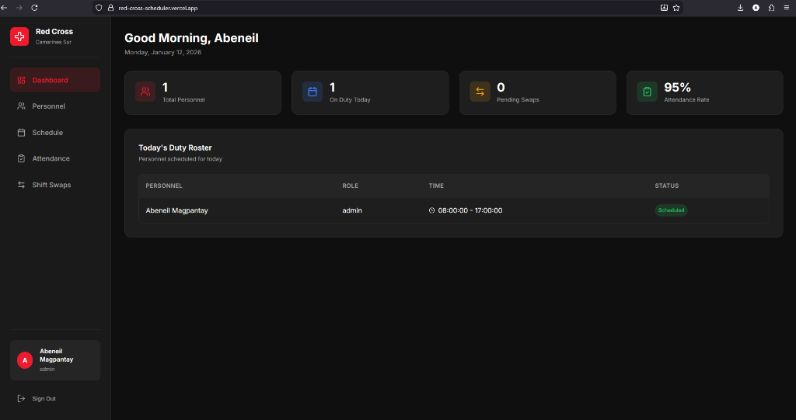
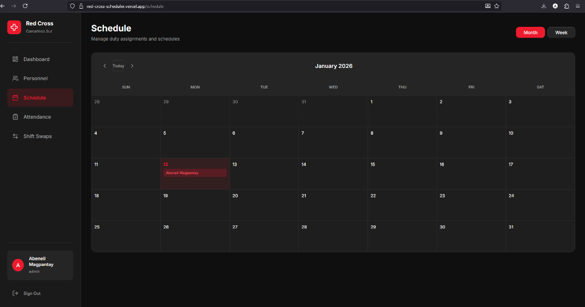
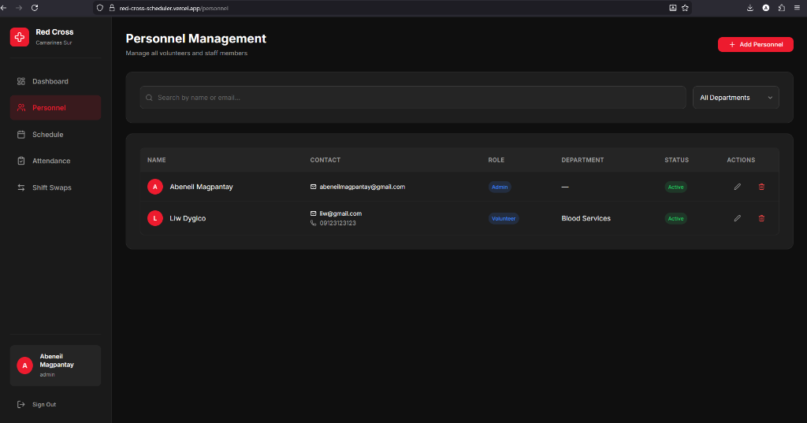
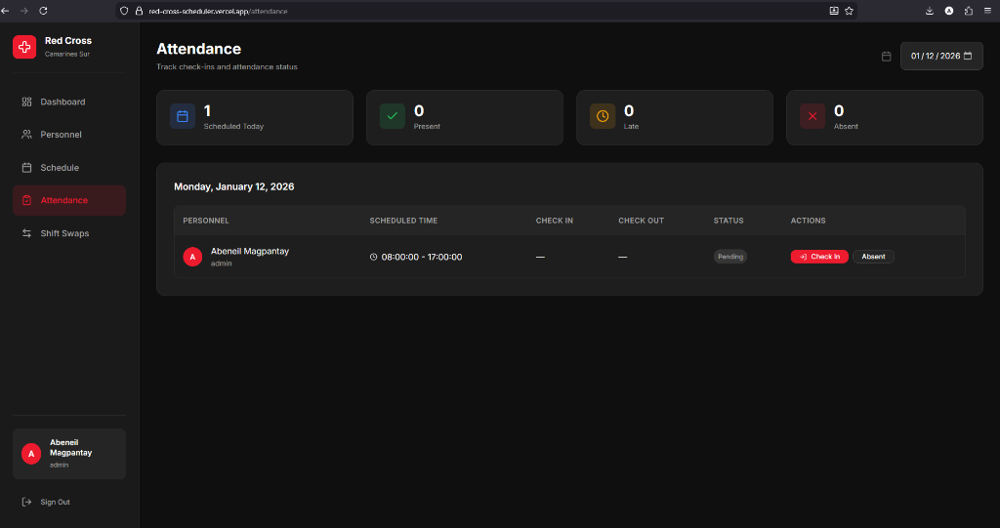
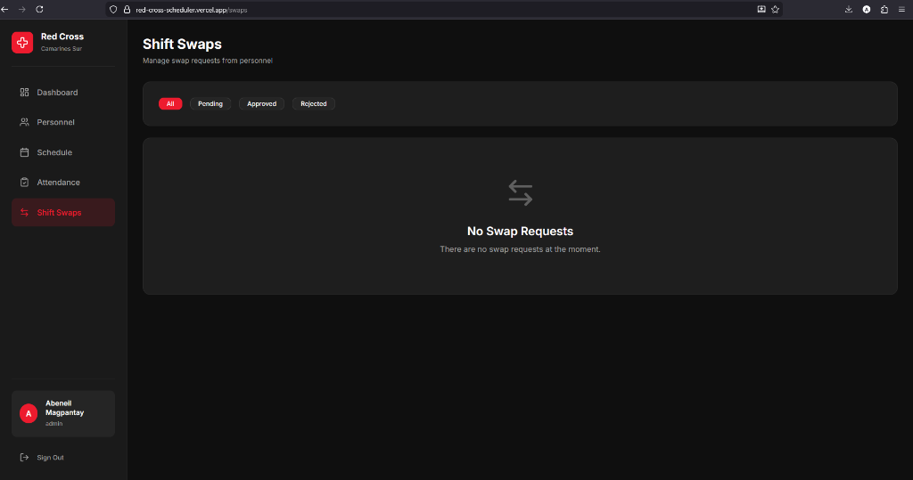

# Red Cross (Camarines Sur) Scheduling System

A comprehensive web-based platform designed to streamline duty scheduling, personnel management, and attendance tracking for the Red Cross Camarines Sur Chapter. This solution modernizes the workflow by replacing manual logs with a centralized, real-time database system.



## Table of Contents

- [Features](#features)
- [Built With](#built-with)
- [Getting Started](#getting-started)
- [Usage](#usage)
- [Deploy](#deploy)
- [License](#license)

## Features

*   **Role-Based Access Control**: Secure authentication distinguishing between administrators and standard volunteers.
*   **Dynamic Scheduling**: Drag-and-drop calendar interface for assigning field duties and managing rosters.
*   **Personnel Management**: Centralized database for staff profiles, contact details, and department allocation.
*   **Attendance Tracking**: Digital check-in/check-out system with automated status reporting (Present, Late, Absent).
*   **Shift Swapping**: Automated workflow for personnel to request and validate shift exchanges.
*   **Real-time Dashboard**: Live statistics on workforce deployment and pending administrative actions.

## Built With

This project exploits a modern tech stack to ensure performance, scalability, and ease of maintenance.

*   [React](https://reactjs.org/) - Frontend library for building user interfaces
*   [Vite](https://vitejs.dev/) - Next Generation Frontend Tooling
*   [Supabase](https://supabase.com/) - Open Source Firebase alternative (PostgreSQL + Auth)
*   [Lucide React](https://lucide.dev/) - Consistent icon set

## Getting Started

Follow these steps to set up the project locally.

### Prerequisites

*   Node.js (v20 or higher recommended)
*   npm or yarn
*   A Supabase project (Free Tier is sufficient)

### Installation

1.  Clone the repository
    ```sh
    git clone https://github.com/AbeneilMagpantay/red-cross-scheduler.git
    ```
2.  Install NPM packages
    ```sh
    npm install
    ```
3.  Configure Environment Variables
    Create a `.env.local` file in the root directory and add your Supabase credentials:
    ```env
    VITE_SUPABASE_URL=your_supabase_project_url
    VITE_SUPABASE_ANON_KEY=your_supabase_anon_key
    ```
4.  Run the application
    ```sh
    npm run dev
    ```

### Google Sign-In

1. Create a Google OAuth Web client and add your application URL as an authorized JavaScript origin.
2. Add `https://YOUR_PROJECT_REF.supabase.co/auth/v1/callback` as an authorized Google redirect URI.
3. Enable Google under **Supabase Dashboard → Authentication → Providers** and enter the Google client ID and secret.
4. Add both the production URL and local development URL to **Authentication → URL Configuration → Redirect URLs**.

Google users must have an existing Personnel record with the same email address. This keeps access administrator-controlled.

### Deployment Notifications

Apply the database migrations, generate Web Push VAPID keys, and deploy the notification function:

```sh
supabase db push
npx web-push generate-vapid-keys
supabase secrets set VAPID_PUBLIC_KEY=... VAPID_PRIVATE_KEY=... VAPID_SUBJECT=mailto:admin@example.com REMINDER_CRON_SECRET=...
supabase functions deploy send-deployment-notifications
supabase functions deploy send-duty-reminders --no-verify-jwt
```

Set the generated public key as `VITE_VAPID_PUBLIC_KEY` in the deployed web app. Notifications require HTTPS in production. On iPhone and iPad, install the site to the Home Screen before enabling background notifications.

For timed duty reminders, create a Supabase Cron job that runs every 15 minutes and sends a `POST` request to `https://YOUR_PROJECT_REF.supabase.co/functions/v1/send-duty-reminders`. Add an `x-cron-secret` header containing the same private value used for `REMINDER_CRON_SECRET`. The reminder function rejects calls that do not have this secret or the service-role token.

## Usage

### Scheduling View
The core interface allows administrators to view and manage monthly schedules. Assignments can be modified or removed directly from the calendar grid.



### Personnel Directory
Manage the volunteer database, including adding new members, updating roles, and monitoring active status.



### Attendance Tracking
Complete digital log of check-ins and check-outs with status monitoring.



### Shift Swaps
Dedicated interface for approving or rejecting shift change requests.



## Deploy

The application is optimized for deployment on Vercel.

1.  Push code to GitHub.
2.  Import project into Vercel.
3.  Set `Framework Preset` to **Vite**.
4.  Add Environment Variables from `.env`.
5.  Deploy.

## License

Distributed under the MIT License. See `LICENSE` for more information.


